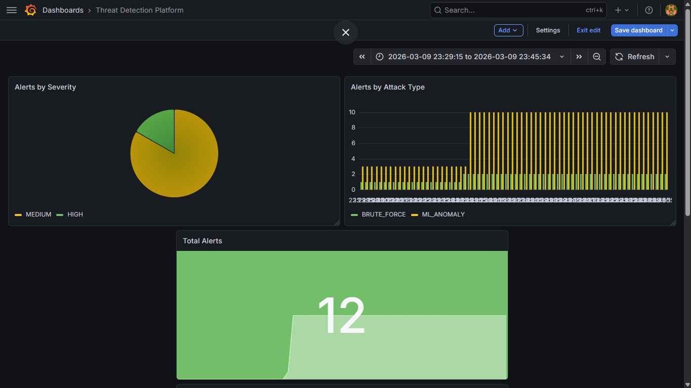

# Cloud-Native Distributed Threat Detection Platform

A production-grade security monitoring platform built with FastAPI microservices, Redis event streaming, PostgreSQL, and Docker. Detects network threats in real-time using both rule-based logic and an Isolation Forest ML model.

---

## Architecture

```
┌─────────────────┐     HTTP POST      ┌──────────────────────┐
│  Log Generator  │ ────────────────►  │  Log Ingestion API   │
│  (Faker-based)  │                    │  FastAPI + SQLAlchemy │
└─────────────────┘                    └──────────┬───────────┘
                                                  │
                                         Store in PostgreSQL
                                         Publish to Redis
                                                  │
                                    ┌─────────────▼────────────┐
                                    │       Redis Pub/Sub       │
                                    │      "logs_channel"       │
                                    └─────────────┬────────────┘
                                                  │
                                    ┌─────────────▼────────────┐
                                    │    Detection Service     │
                                    │                          │
                                    │  Rule-Based Detection:   │
                                    │  • Port Scan (>10 ports) │
                                    │  • Brute Force (SSH)     │
                                    │  • Large Data Transfer   │
                                    │                          │
                                    │  ML Detection:           │
                                    │  • Isolation Forest      │
                                    │  • 12,000 training logs  │
                                    │                          │
                                    │  Metrics: Prometheus     │
                                    └─────────────┬────────────┘
                                                  │
                                         Insert alert into DB
                                                  │
                                    ┌─────────────▼────────────┐
                                    │      Alert Service       │
                                    │   FastAPI + PostgreSQL   │
                                    │   GET /alerts endpoint   │
                                    └──────────────────────────┘
```

---

## Tech Stack

| Layer | Technology |
|-------|-----------|
| API Framework | FastAPI |
| Database | PostgreSQL 15 |
| Event Streaming | Redis 7 Pub/Sub |
| ML Detection | Scikit-learn (Isolation Forest) |
| Monitoring | Prometheus + Grafana |
| Containerization | Docker + Docker Compose |
| Orchestration (WIP) | Kubernetes |
| Cloud (WIP) | AWS |

---

## Services

### Log Ingestion Service (port 8000)
Receives log events via REST API, stores them in PostgreSQL, and publishes each event to a Redis channel for downstream processing.

### Detection Service (port 8001)
Subscribes to Redis and processes every log in real-time using two detection engines:

**Rule-Based:**
- **Port Scan** — flags IPs hitting more than 10 unique ports within a 10-second window
- **Brute Force** — flags IPs making repeated SSH (port 22) connection attempts
- **Large Data Transfer** — flags transfers exceeding 5,000 bytes

**ML-Based:**
- Isolation Forest model trained on 12,000 synthetic log samples
- Features: port number, bytes sent, request rate (time-windowed)
- Flags statistical outliers as anomalies

Exposes Prometheus metrics at `/metrics` including `logs_processed_total` and `alerts_triggered_total` labelled by severity and type.

### Alert Service (port 8002)
Reads and returns all generated alerts from PostgreSQL via a REST endpoint.

---

## Getting Started

### Prerequisites
- Docker Desktop
- Git

### Run the platform

```bash
# Clone the repo
git clone https://github.com/sanaanidhal/cloud-threat-detection-platform.git
cd cloud-threat-detection-platform

# Start all services
docker compose up --build
```

That's it. Docker starts PostgreSQL, Redis, and all three microservices automatically with health checks and correct startup ordering.

### Verify it's working

| Endpoint | Description |
|----------|-------------|
| `http://localhost:8000/docs` | Log Ingestion — Swagger UI |
| `http://localhost:8001/metrics` | Detection Service — Prometheus metrics |
| `http://localhost:8002/alerts` | Alert Service — all generated alerts |

### Send a test log

```bash
curl -X POST http://localhost:8000/logs \
  -H "Content-Type: application/json" \
  -d '{
    "source_ip": "192.168.1.100",
    "destination_ip": "10.0.0.5",
    "port": 22,
    "protocol": "TCP",
    "bytes_sent": 150,
    "timestamp": "2026-01-01T12:00:00"
  }'
```

Send this 6+ times with port 22 and check `http://localhost:8002/alerts` — you will see a `BRUTE_FORCE` alert appear.

### Simulate realistic traffic

```bash
# Run the log generator (requires Python + venv locally)
cd scripts/log-generator
pip install -r requirements.txt
python generator.py
```

### Retrain the ML model

```bash
cd ml
python generate_training_data.py
python train_model.py
cp model.pkl ../services/detection-service/model.pkl
```

---

## Project Structure

```
cloud-threat-detection-platform/
├── services/
│   ├── log-ingestion/
│   │   ├── app/
│   │   │   ├── main.py          # FastAPI routes
│   │   │   ├── models.py        # SQLAlchemy models
│   │   │   ├── schemas.py       # Pydantic schemas
│   │   │   ├── database.py      # DB connection
│   │   │   └── redis_client.py  # Redis publisher
│   │   ├── Dockerfile
│   │   └── requirements.txt
│   ├── detection-service/
│   │   ├── app/
│   │   │   ├── main.py              # FastAPI app
│   │   │   ├── redis_subscriber.py  # Event consumer + detection logic
│   │   │   ├── ml_model.py          # Isolation Forest inference
│   │   │   └── metrics.py           # Prometheus metrics
│   │   ├── Dockerfile
│   │   └── requirements.txt
│   └── alert-service/
│       ├── app/
│       │   └── main.py          # FastAPI routes
│       ├── Dockerfile
│       └── requirements.txt
├── scripts/
│   └── log-generator/
│       └── generator.py         # Synthetic traffic generator
├── ml/
│   ├── generate_training_data.py
│   ├── train_model.py
│   └── training_logs.csv
├── init.sql                     # Database schema
├── docker-compose.yml
└── README.md
```

---

## Roadmap

- [x] FastAPI microservices
- [x] Redis Pub/Sub event streaming
- [x] PostgreSQL storage
- [x] Rule-based threat detection
- [x] Isolation Forest ML anomaly detection
- [x] Prometheus metrics
- [x] Docker + Docker Compose
- [x] Prometheus + Grafana dashboards
- [ ] Kubernetes deployment
- [ ] AWS deployment (EC2 / EKS)
- [ ] GitHub Actions CI/CD pipeline

---

## Detection Examples

| Alert Type | Trigger | Severity |
|-----------|---------|---------|
| `PORT_SCAN` | >10 unique ports from same IP in 10s | HIGH |
| `BRUTE_FORCE` | >5 SSH attempts from same IP in 10s | HIGH |
| `LARGE_DATA_TRANSFER` | bytes_sent > 5000 | MEDIUM |
| `ML_ANOMALY` | Isolation Forest outlier score | MEDIUM |

---

## Dashboard

Real-time security monitoring dashboard built with Grafana and Prometheus.



Panels:
- **Logs Ingested/Processed per Minute** — pipeline throughput in real time
- **Total Alerts** — live count of all triggered alerts
- **Alerts by Attack Type** — breakdown of BRUTE_FORCE, PORT_SCAN, ML_ANOMALY, LARGE_DATA_TRANSFER
- **Alerts by Severity** — HIGH vs MEDIUM distribution
- **Average Log Processing Time** — detection engine latency in milliseconds
## Environment Variables

Each service reads configuration from environment variables (injected by Docker Compose):

| Variable | Description |
|----------|-------------|
| `DATABASE_URL` | PostgreSQL connection string |
| `REDIS_HOST` | Redis hostname |
| `REDIS_PORT` | Redis port (default 6379) |

> **Note:** Never commit `.env` files. The `docker-compose.yml` injects all required variables at runtime.
